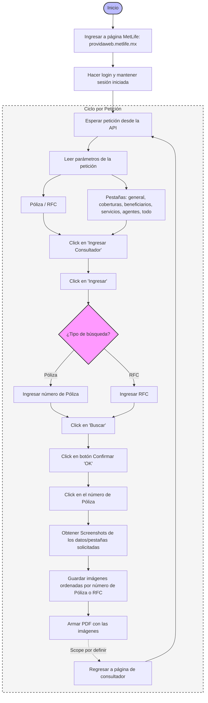

# Diagrama de Proceso RPA Consultador

```mermaid
flowchart TD
    Start([Inicio]) --> Init[Ingresar a página MetLife: providaweb.metlife.mx]
    Init --> Login[Hacer login y mantener sesión iniciada]
    
    Login --> API
    
    subgraph CicloPeticion [Ciclo por Petición]
        API[Esperar petición desde la API] --> Params[Leer parámetros de la petición]
        
        Params --> ParamPoliza[Póliza / RFC]
        Params --> ParamPestanas[Pestañas: general, coberturas, beneficiarios, servicios, agentes, todo]
        
        ParamPoliza --> ClickConsultador[Click en 'Ingresar Consultador']
        ParamPestanas --> ClickConsultador
        
        ClickConsultador --> ClickIngresar[Click en 'Ingresar']
        
        ClickIngresar --> DecisionBuscar{¿Tipo de búsqueda?}
        DecisionBuscar -->|Póliza| InputPoliza[Ingresar número de Póliza]
        DecisionBuscar -->|RFC| InputRFC[Ingresar RFC]
        
        InputPoliza --> ClickBuscar[Click en 'Buscar']
        InputRFC --> ClickBuscar
        
        ClickBuscar --> ClickConfirmar[Click en botón Confirmar 'OK']
        ClickConfirmar --> ClickNumPoliza[Click en el número de Póliza]
        
        ClickNumPoliza --> Screenshots[Obtener Screenshots de los datos/pestañas solicitadas]
        Screenshots --> Guardar[Guardar imágenes ordenadas por número de Póliza o RFC]
        
        Guardar --> PDF[Armar PDF con las imágenes]
        PDF -.->|Scope por definir| Regresar[Regresar a página de consultador]
    end
    
    Regresar --> API
    
    style DecisionBuscar fill:#f9f,stroke:#333,stroke-width:2px
    style Start fill:#bbf,stroke:#333,stroke-width:2px
    style CicloPeticion fill:#f5f5f5,stroke:#666,stroke-width:2px,stroke-dasharray: 5 5
```
