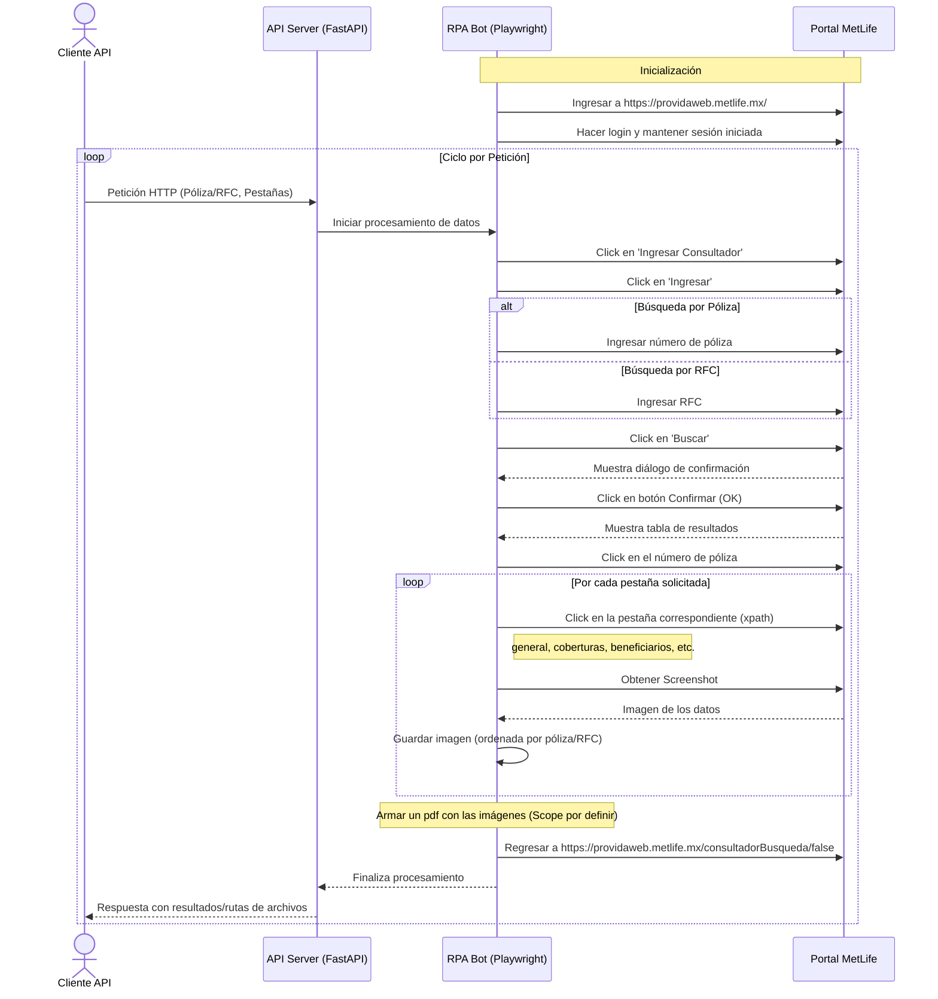

# Diagrama de Secuencia RPA Consultador

```mermaid
sequenceDiagram
    actor ClienteAPI as Cliente API
    participant Server as API Server (FastAPI)
    participant Bot as RPA Bot (Playwright)
    participant Portal as Portal MetLife
    
    Note over Bot, Portal: Inicialización
    Bot->>Portal: Ingresar a https://providaweb.metlife.mx/
    Bot->>Portal: Hacer login y mantener sesión iniciada
    
    loop Ciclo por Petición
        ClienteAPI->>Server: Petición HTTP (Póliza/RFC, Pestañas)
        Server->>Bot: Iniciar procesamiento de datos
        
        Bot->>Portal: Click en 'Ingresar Consultador'
        Bot->>Portal: Click en 'Ingresar'
        
        alt Búsqueda por Póliza
            Bot->>Portal: Ingresar número de póliza
        else Búsqueda por RFC
            Bot->>Portal: Ingresar RFC
        end
        
        Bot->>Portal: Click en 'Buscar'
        Portal-->>Bot: Muestra diálogo de confirmación
        Bot->>Portal: Click en botón Confirmar (OK)
        
        Portal-->>Bot: Muestra tabla de resultados
        Bot->>Portal: Click en el número de póliza
        
        loop Por cada pestaña solicitada
            Bot->>Portal: Click en la pestaña correspondiente (xpath)
            Note right of Bot: general, coberturas, beneficiarios, etc.
            Bot->>Portal: Obtener Screenshot
            Portal-->>Bot: Imagen de los datos
            Bot->>Bot: Guardar imagen (ordenada por póliza/RFC)
        end
        
        Note over Bot: Armar un pdf con las imágenes (Scope por definir)
        
        Bot->>Portal: Regresar a https://providaweb.metlife.mx/consultadorBusqueda/false
        
        Bot-->>Server: Finaliza procesamiento
        Server-->>ClienteAPI: Respuesta con resultados/rutas de archivos
    end
```
